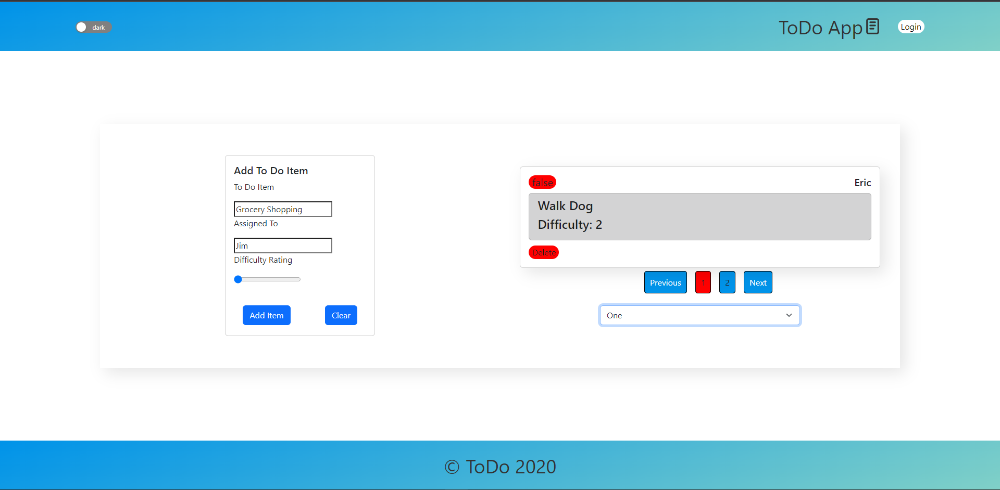

> # LAB - 32

## Setup

- `npm i`  
- `.env` requirements: (none)
- `PORT` - n/a

## Scripts

### `npm start`

Runs the App in the development mode  
Open http://localhost:3000/ to view in browser.

### `npm test`

Launches test  runner in the interactive watch mode.

### `npm run build`

builds the application for production.

### `npm run eject`

 Removes the single build dependency from your project.

  
  
